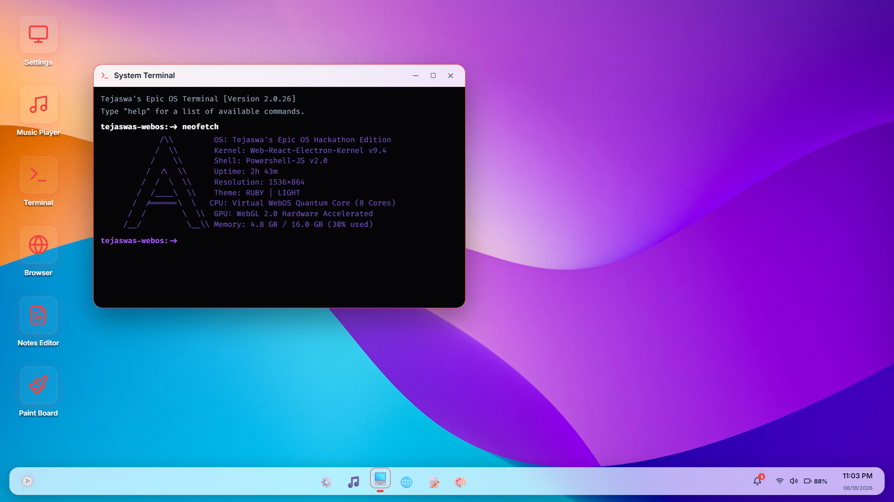
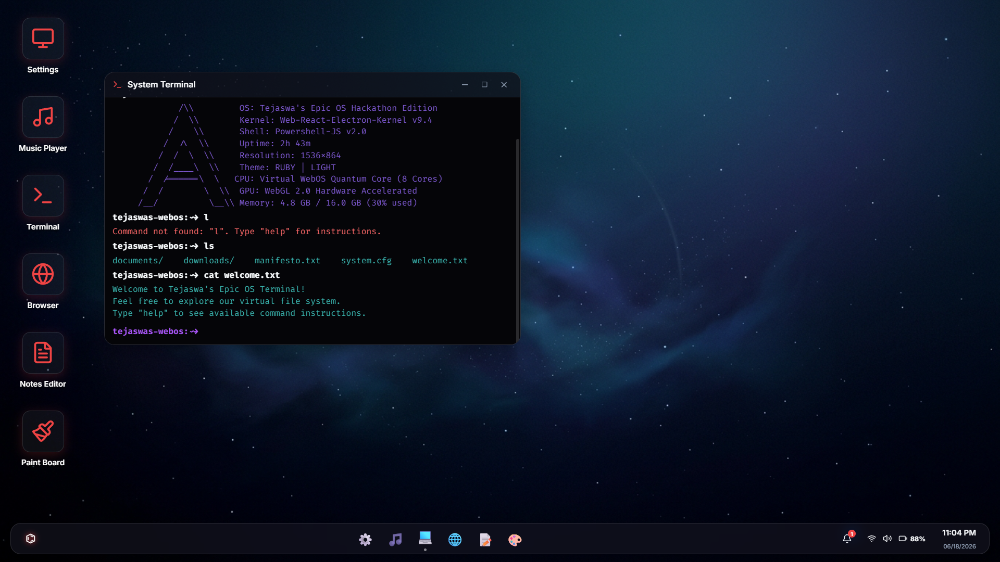

# Tejaswa's Epic WebOS

A browser-based desktop environment built with React and Vite.

The primary focus of the project is an interactive Linux-inspired terminal emulator that implements a virtual filesystem and common shell commands entirely in the browser. The desktop environment and bundled applications exist mainly to provide a realistic operating system interface around the terminal experience.

## Features

### Terminal

The terminal is the core component of the project and includes:

* Linux-inspired command interface
* Virtual filesystem
* `ls` directory listing
* `cat` file reading
* `touch` file creation
* `mkdir` directory creation
* `neofetch` system information
* Theme management commands
* Matrix mode
* Command history

Example:

```bash
touch notes.txt
cat notes.txt
mkdir projects
ls
neofetch
```

### Browser

A browser like app surf internet on :3

### Music player

for ur music needs

### Paint

i mean a mans gotta draw

### A notes app

who doesnt love a nice notes app

### And more coming

## Demo

Live Deployment:

https://web-os-fawn-two.vercel.app

## Installation

Clone the repository:

```bash
git clone https://github.com/tejaswa4692/WebOS
```

Install dependencies:

```bash
npm install
```

Start the development server:

```bash
npm run dev
```

Open:

```text
http://localhost:5173
```


## Technologies Used

* React
* Vite
* JavaScript
* HTML5
* CSS3

## Future Plans

* An entirely custom python inspired programming lanuage
* A text editor for that programmign lanuage
* a file browser to easily see the files you have made

## Screenshots 





